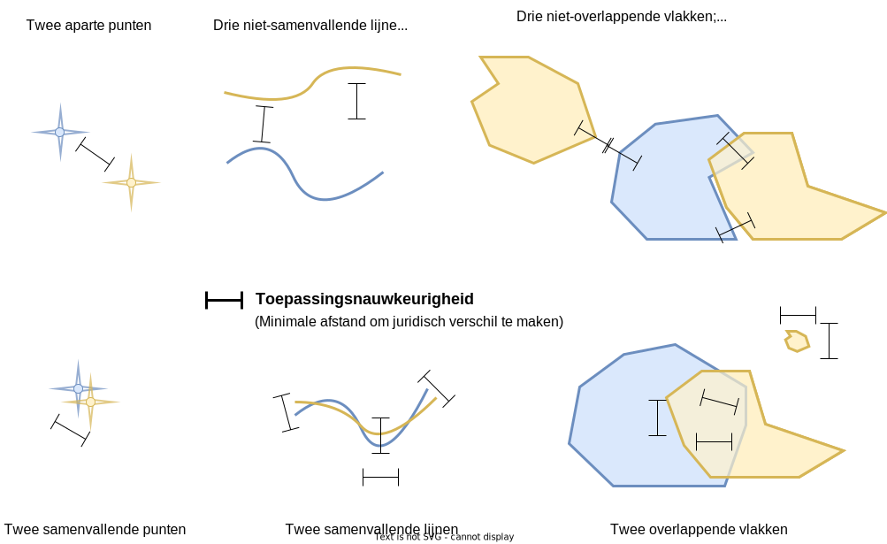

# Toepassingsnauwkeurigheid

De toepassingsnauwkeurigheid is een maat die gebruikt wordt om te bepalen 
of en waar twee geometrieën significant afwijken.

Zie de [uitleg](@@@GeoTools_Pages_Url@@@) voor een interactieve toelichting.
