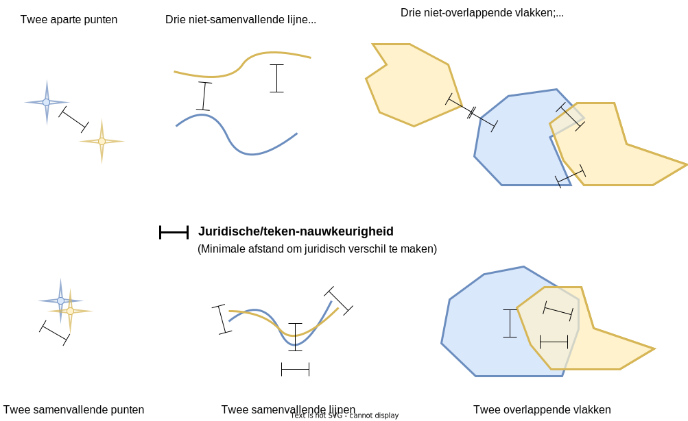
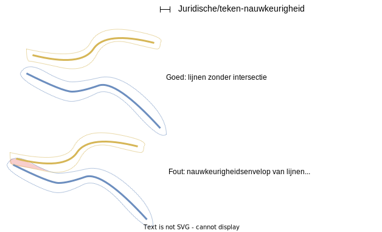

# Cntrole op geschiktheid van een GIO

## Cntrole op geschiktheid van een GIO

Controleert dat het GIO geen details bevat die het geautomatiseerd bepalen van de wijzigingen tussen twee GIO-versies in de weg staat. De grens aan de toegestane mate van detaillering wordt gegeven door de tekennauwkeurigheid. Als een GIO niet geschikt bevonden wordt hoeft dat niet aan de inhoud van het GIO te liggen, het kan ook zijn dat de tekennauwkeurigheid verkeerd ingeschat is.

Deze geo-tool kan ook gebruikt worden om een STOP gebiedsmarkering of effectgebied te bekijken.

Online: [Tonen/controleren van geo-informatie](@@@GeoTools_Online_Url@@@toon_geo).

Python script: [toon_geo.py](../blob/main/broncode/geo-tools/toon_geo.py) met gebruik making van [geo_manipulatie.py](../blob/main/broncode/geo-tools/geo_manipulatie.py).

## Tekennauwkeurigheid
Een geo-informatieobject (GIO) legt vast waar juridische regels gelden, en geeft eventueel ook een normwaarde voor een locatie. Met de term *tekennauwkeurigheid* wordt in deze geo-tools de geometrische nauwkeurigheid bedoeld waarmee de locatie door (of in overleg met) de juristen is "ingetekend", hoe "dik" de punten en lijnen zijn. Het is het antwoord op de vraag: hoe ver van de exacte locatie zoals in het GIO is opgenomen zijn nog steeds dezelfde regels van toepassing? Dat zal van de context afhangen. Voor regels over bouwen op een perceel is 1 meter veel en zal een locatie in het GIO de perceelgrenzen tot op een decimeter nauwkeurig volgen. De locaties voor bouwhoogtebeperkingen rond Schiphol zullen niet op een decimeter nauwkeurig bepaald hoven te worden; de tekennauwkeurigheid kan daar best meters of meer zijn.

In een GIO moet ondubbelzinnig vastgelegd zijn waar de regels en/of normwaarde gelden. Dan verwacht een "lezer" van de geo-informatie dat er geen relevante details zijn die kleiner zijn dan de tekennauwkeurigheid. Maar ook dat details die kleiner zijn dan de tekennauwkeurigheid er niet toe doen. De tekennauwkeurigheid is geen "hard" getal dat onderdeel is van de geo-informatie, meer een leiddraad voor het bevoegd gezag bij het opstellen van het GIO. Het is het geo-equivalent van een schrijfstijl. Als een regeling globale regels bevat dan zullen die niet tot in de kleinste details zijn uitgewerkt. 

Voor het bepalen van de wijzigingen die in de ene versie van het GIO ten opzichte van de voorgaande versie zijn aangebracht kunnen details kleiner den de tekennauwkeurigheid genegeerd worden. Om dit geautomatiseerd te kunnen doen mogen dergelijke details niet in het GIO voorkomen - de automatisering kan wijzigingen daarin niet detecteren. In onderstaande figuur staat aangegeven wat wel en niet in een GIO mag voorkomen.

In woorden:
* Punt-locaties moeten verder dan de tekennauwkeurigheid uit elkaar liggen (bovenste rij). Punten met een onderlinge afstand kleiner dan de tekennauwkeurigheid (onderste rij) zijn niet toegestaan.
* Lijn-locaties waarvan de onderlinge afstand groter is dan de tekennauwkeurigheid (bovenste rij) zijn toegestaan.
* Lijn-locaties mogen geen onderlinge afstand hebben die kleiner is dan de tekennauwkeurigheid (onderste rij). Lijn-locaties mogen elkaar ook niet snijden.
* Vlak-locaties zijn toegestaan als de onderlinge afstand tussen de locaties groter is dan de tekennauwkeurigheid (bovenste rij).
* Vlak-locaties die overlappen of naast elkaar liggen waarbij zowel de afmetingen van de overlap als de onderlinge afstand kleiner is dan de tekennauwkeurigheid (bovenste rij) worden geacht elkaar te raken en elkaar niet te overlappen. Dit is toegestaan.
* Vlak-locaties die elkaar overlappen waarbij zowel de hoogte als breedte van de overlap groter is dan de tekennauwkeurigheid (onderste rij) zijn niet toegestaan.

Als een GIO voor een gegeven tekennauwkeurigheid niet voldoet aan deze voorwaarden, kan dat ook liggen aan een verkeerde inschatting van de tekennauwkeurigheid:

* Als punten, lijnen of vlakken op onvoldoende afstand van elkaar staan, dan is het GIO in groter detail getekend dan verwacht. Het GIO kan wel geschikt zijn bij een kleinere waarde voor de tekennauwkeurigheid.
* Als vlakken een te grote mate van overlap kennen, dan is het GIO minder geteailleerd getekend dan verwacht. Bij een grotere waarde van de tekennauwkeurigheid kan het GIO wel geschikt zijn.

Hieruit zijn randvoorwaarden voor een GIO af te leiden:
* Als twee punten dezelfde positie hebben zal een GIO nooit geschikt zijn.
* Als twee lijnen elkaar snijden zal de GIO nooit geschikt zijn.
* Als de vlakken in het GIO een overlap kennen die groter is dan de kleinste afstand tussen niet-overlappende vlakken, dan bestaat er geen tekennauwkeurigheid waarvoor het GIO geschikt is.

## Algoritme

De geo-tools werken alleen als een GIO uitsluitend punten, lijnen of vlakken hebben.

De ondersteunde geometrieën zijn _Point_, _LineString_ en _Polygon_ en de meervoudige _MultiGeometry_, _MultiPoint_, _MultiCurve_ en _MultiSurface_ (via [pygml](https://github.com/geopython/pygml)). De eerste stap is om de _Multi_-varianten om te vormen naar enkele geometrieën. Zo ontstaat een reeks met paren (basisgeometrie-id, _Point_ of _LineString_ of _Polygon_).

### Punten
In het geval van punten wordt van elk paar punten de afstand berekend. Punten die een onderlinge afstand kleiner dan de _tekennauwkeurigheid_ hebben, worden gerapporteerd en leiden tot ongeschiktheid van het GIO. Het kan dus gaan om punten van dezelfde _MultiPoint_ geometrie. Voor een ongeschikte GIO wordt daarne de minimale afstand van de puntparen bepaald. Mits groter dan nul is dit de tekennauwkeurigheid waarbij het GIO wel geldig is.

### Lijnen
Om elke lijn wordt een buffer gelegd met afstand _tekennauwkeurigheid_. Daarna wordt voor elk paar gebufferde lijnen de intersectie bepaald. Als de intersectie een resultaatgebied oplevert, dan is het GIO ongeschikt. Voor een ongeschikte GIO wordt daarna de afstand tussen de lijnparen bepaald. Mits groter dan nul is dit de tekennauwkeurigheid waarbij het GIO wel geldig is.

### Vlakken
